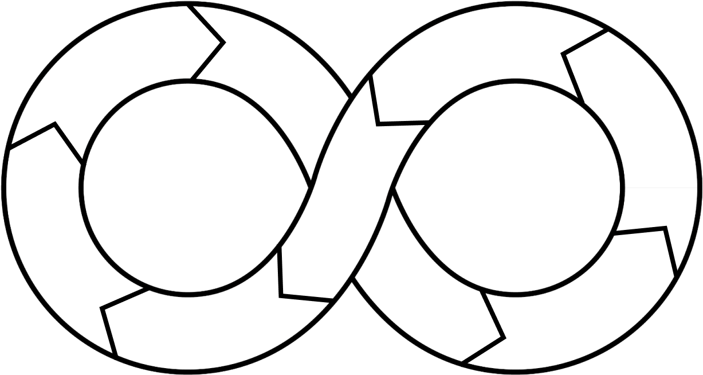

<!--
class: slide_cover
-->

# 株式会社 senren

## 仕様変更に強く、サービスインまでの期間を短縮できるチーム、エンジニアリソースを提供します。

---

<!--
class: index
-->

###### 目次

# 目次

1. 会社概要 ------------------------------- 3
2. 事業内容 ------------------------------- 5
3. 取り組んでいる課題 ------------------------------- 9
4. お取引までの流れ ------------------------------- 11
5. サポート体制に関して ------------------------------- 13

---

<!--
class: slide_page
-->

# 01

## 会社概要

### company profile

---

<!--
class: business_detail_content
-->

###### 会社概要

# 事業内容について

- テクノロジー
  コンサルティングサービス
- 事業開発
  コンサルティングサービス
- 業務改革
  コンサルティングサービス

---

<!--
class: company_about
-->

###### 会社概要

# 株式会社 senren について

## その改革が、企業の未来を切り拓く

### テクノロジーとビジネスの豊富な知見を有するプロフェッショナル、お客様のビジネスを加速させます

---

<!--
class: company_information
-->

###### 会社概要

# 会社概要

- 創業年月日
  2020 年（令和 2 年）3 月 1 日（洗練）
- 設立年月日
  2021 年（令和 3 年）6 月 22 日
- 資本金 100 万円
  （2022 年 9 月 27 日現在）
- 本店所在地
  〒 733-0876
  広島県広島市西区高須台二丁目７番１３号
- 代表
  畠山大我

---

<!--
class: slide_page
-->

# 02

## 事業紹介

### Business Introduction

---

<!--
class: business_detail_2
-->

###### 事業紹介

# 事業内容について

- ### 事業開発コンサルティングサービス

  企画立ち上げから一気通貫での開発や、既存のシステムの一部改修など幅広くご支援させていただきます。

- ### 業務改革コンサルティングサービス

  業務の可視化から改革までを事業活動の「計画」「実施」「監視」「改善」サイクルによって見直し・効率化・改善を推進します。

- ### テクノロジーコンサルティングサービス
  採用に時間と労力をかけられない企業様に即戦力となる経験豊富なエンジニアをご紹介し、採用プロセスの手間を大幅に削減します

---

<!--
class: business_content
-->

###### 事業紹介

# 1

## 事業開発コンサルティングサービス

#### 企画立ち上げから一気通貫での開発や、既存のシステムの一部改修など幅広くご支援させていただきます。

- ##### 目的

  企業の持続可能な成長と業務効率の向上を目指し、最先端のデジタル技術を駆使したシステム開発支援を提供しています。DX（デジタルトランスフォーメーション）の推進により、お客様のビジネス変革を実現し、市場での競争力を強化することに尽力します。

- ##### ソリューション

  当社の事業開発コンサルティングサービスは、カスタマイズ可能なシステム開発や DX 戦略策定支援等により企業様のデジタルトランスフォーメーションと持続可能な成長を支援します。

- ##### 導入事例
  ・デザイナーズホテルのチェックインシステム開発
  ・ペストコントロール事業の立ち上げ

---

<!--
class: business_content
-->

###### 事業紹介

# 2

## テクノロジーコンサルティングサービス

#### 採用に時間と労力をかけられない企業様に即戦力となる経験豊富なエンジニアをご紹介し、採用プロセスの手間を大幅に削減します

- ##### 目的

  企業の持続可能な成長と業務効率の向上を目指し、最先端のデジタル技術を駆使したシステム開発支援を提供しています。DX（デジタルトランスフォーメーション）の推進により、お客様のビジネス変革を実現し、市場での競争力を強化することに尽力します。

- ##### ソリューション

  一般的に IT インフラストラクチャ管理やアプリケーション開発およびメンテナンス等が挙げられます。
  これらのソリューションを通じて、企業様の IT 関連の複雑さを低減し、ビジネスの成長と効率化を加速させます。

- ##### 導入事例
  ・大手飲食店の冷蔵庫のIoTシステムの開発支援
  ・建設会社の積算システムの開発支援

---

<!--
class: business_content
-->

###### 事業紹介

# 3

## 業務改革コンサルティングサービス

#### 業務の可視化から改革までを事業活動の「計画」「実施」「監視」「改善」サイクルによって見直し・効率化・改善を推進します。

- ##### 目的

  企業の業務プロセスを効率化し、生産性を向上させることにあります。これを通じて、企業はコスト削減、品質の向上、顧客満足度の向上、そして市場での競争力の強化を実現することができます。具体的には、以下のような目標を達成することを目指します。

- ##### ソリューション

  お客様の立場に立って、改革対象業務の可視化・課題解析・改革プロセス設計をご支援し、BPM 推進ノウハウを提供します。単に業務改革のコンサルティングを提供するに留まらず、実装とベンダー管理も含めた全面的な支援をお約束いたします。

- ##### 導入事例
  ・小売事業者のバックオフィス全般の業務改革のご支援
  ・不動産仲介の電子契約化から各種証憑の自動作成のご支援

---

<!--
class: slide_page
-->

# 03

## 当社が取り組んでいる課題について

### About Our Challenges

---

<!--
class: about_our_challenges
-->

###### 事業紹介

# 当社が取り組んでいる課題について

## 概要文章

- ### 課題 1

  説明説明説明説明説明説明説明説明説明説明説明説明説明説明説明説明説明説明説明説明説明説明説明説明説明説明説明説明説明説明説明説明説明説明説明説明説明説明説明説明説明説明説明説明説明説明説明説明説明説明説明説明説明説明説明説明説明説明説明説明説明説明説明説明説明

- ### 課題 2

  説明説明説明説明説明説明説明説明説明説明説明説明説明説明説明説明説明説明説明説明説明説明説明説明説明説明説明説明説明説明説明説明説明説明説明説明説明説明説明説明説明説明説明説明説明説明説明説明説明説明説明説明説明説明説明説明説明説明説明説明説明説明説明説明説明

- ### 課題 3
  説明説明説明説明説明説明説明説明説明説明説明説明説明説明説明説明説明説明説明説明説明説明説明説明説明説明説明説明説明説明説明説明説明説明説明説明説明説明説明説明説明説明説明説明説明説明説明説明説明説明説明説明説明説明説明説明説明説明説明説明説明説明説明説明説明

---

<!--
class: transaction_flow_content
-->

###### お取引までの流れ

# お取引までの流れについて

- ヒアリング
- ご提案
- お見積り
- ご契約締結
- 契約開始

---

<!--
class: slide_page
-->

# 05

## サポート体制

### Support Structure

---

<!--
class: support_content
-->

###### サポート体制

# 問い合わせ対応時間/サポートチャネル

- ## 平均的な応答時間
  2営業日以内
- ## 利用可能なコミュニケーションチャネル
  Googlechatを使用いたします。

---

<!--
class: contact_content
-->

###### サポート体制

# 連絡先

## contract@senren.dev

### 上記のメールアドレスにご連絡お願い致します。

---

<!--
class: work_reform_support
-->

###### 事業紹介

# 業務改革支援

## BPM について

### BPM-labo 事業

そもそもビジネスプロセスマネジメントとは?

まず、そもそもビジネスプロセスマネジメントとはなにか？という点を知る必要があります。これは、各部門で実施されている業務のやり方、システムを分析し組織するという業務管理手法のことを指します。

部門ごと、もしくはプロジェクトごとの細かなプロセスの改善から、会社全体のシステムの改善を図ることを目的とします。短期的な改善というよりも、企業の長期目標に関わるもので、より大きな面での業務改革を図っていきます。

---

<!--
class: bpm
-->

###### 事業紹介

# 持続可能な BPM

---

<!--
class: bpm_list color_change_1
-->

###### 事業紹介

# 持続可能な BPM

- 1
- 2
- 3
- 4
- 5
- 6
- 7
- 8
- 9

1. 課題のリストアップ
2. 課題への評価
3. 着手する課題の選定
4. 可視化フェーズ
5. 評価分析
6. 設計フェーズ
7. 実装フェーズ
8. 実行準備フェーズ
9. モニタリングフェーズ

---

<!--
class: bpm_list color_change_2
-->

###### 事業紹介

# 持続可能な BPM

- 1
- 2
- 3
- 4
- 5
- 6
- 7
- 8
- 9

1. 課題のリストアップ
2. 課題への評価
3. 着手する課題の選定
4. 可視化フェーズ
5. 評価分析
6. 設計フェーズ
7. 実装フェーズ
8. 実行準備フェーズ
9. モニタリングフェーズ

---

<!--
class: bpm_list color_change_3
-->

###### 事業紹介

# 持続可能な BPM

- 1
- 2
- 3
- 4
- 5
- 6
- 7
- 8
- 9

1. 課題のリストアップ
2. 課題への評価
3. 着手する課題の選定
4. 可視化フェーズ
5. 評価分析
6. 設計フェーズ
7. 実装フェーズ
8. 実行準備フェーズ
9. モニタリングフェーズ

---

<!--
class: bpm_list color_change_4
-->

###### 事業紹介

# 持続可能な BPM

- 1
- 2
- 3
- 4
- 5
- 6
- 7
- 8
- 9

1. 課題のリストアップ
2. 課題への評価
3. 着手する課題の選定
4. 可視化フェーズ
5. 評価分析
6. 設計フェーズ
7. 実装フェーズ
8. 実行準備フェーズ
9. モニタリングフェーズ

---

<!--
class: bpm_list color_change_5
-->

###### 事業紹介

# 持続可能な BPM

- 1
- 2
- 3
- 4
- 5
- 6
- 7
- 8
- 9

1. 課題のリストアップ
2. 課題への評価
3. 着手する課題の選定
4. 可視化フェーズ
5. 評価分析
6. 設計フェーズ
7. 実装フェーズ
8. 実行準備フェーズ
9. モニタリングフェーズ

---

<!--
class: bpm_list color_change_6
-->

###### 事業紹介

# 持続可能な BPM

- 1
- 2
- 3
- 4
- 5
- 6
- 7
- 8
- 9

1. 課題のリストアップ
2. 課題への評価
3. 着手する課題の選定
4. 可視化フェーズ
5. 評価分析
6. 設計フェーズ
7. 実装フェーズ
8. 実行準備フェーズ
9. モニタリングフェーズ

---

<!--
class: bpm_list color_change_7
-->

###### 事業紹介

# 持続可能な BPM

- 1
- 2
- 3
- 4
- 5
- 6
- 7
- 8
- 9

1. 課題のリストアップ
2. 課題への評価
3. 着手する課題の選定
4. 可視化フェーズ
5. 評価分析
6. 設計フェーズ
7. 実装フェーズ
8. 実行準備フェーズ
9. モニタリングフェーズ

---

<!--
class: bpm_list color_change_8
-->

###### 事業紹介

# 持続可能な BPM

- 1
- 2
- 3
- 4
- 5
- 6
- 7
- 8
- 9

1. 課題のリストアップ
2. 課題への評価
3. 着手する課題の選定
4. 可視化フェーズ
5. 評価分析
6. 設計フェーズ
7. 実装フェーズ
8. 実行準備フェーズ
9. モニタリングフェーズ

---

<!--
class: bpm_list color_change_9
-->

###### 事業紹介

# 持続可能な BPM

- 1
- 2
- 3
- 4
- 5
- 6
- 7
- 8
- 9

1. 課題のリストアップ
2. 課題への評価
3. 着手する課題の選定
4. 可視化フェーズ
5. 評価分析
6. 設計フェーズ
7. 実装フェーズ
8. 実行準備フェーズ
9. モニタリングフェーズ

---

<!--
class: content_list
-->

###### タイトル

# タイトル

## タイトルの概要文章

- ### タイトル 1

  説明説明説明説明説明説明説明説明説明説明説明説明説明説明説明説明説明説明説明説明説明説明説明説明説明説明説明説明

- ### タイトル 2

  説明説明説明説明説明説明説明説明説明説明説明説明説明説明説明説明説明説明説明説明説明説明説明説明説明説明説明説明

- ### タイトル 3

  説明説明説明説明説明説明説明説明説明説明説明説明説明説明説明説明説明説明説明説明説明説明説明説明説明説明説明説明

- ### タイトル 4

  説明説明説明説明説明説明説明説明説明説明説明説明説明説明説明説明説明説明説明説明説明説明説明説明説明説明説明説明

- ### タイトル 5
  説明説明説明説明説明説明説明説明説明説明説明説明説明説明説明説明説明説明説明説明説明説明説明説明説明説明説明説明
