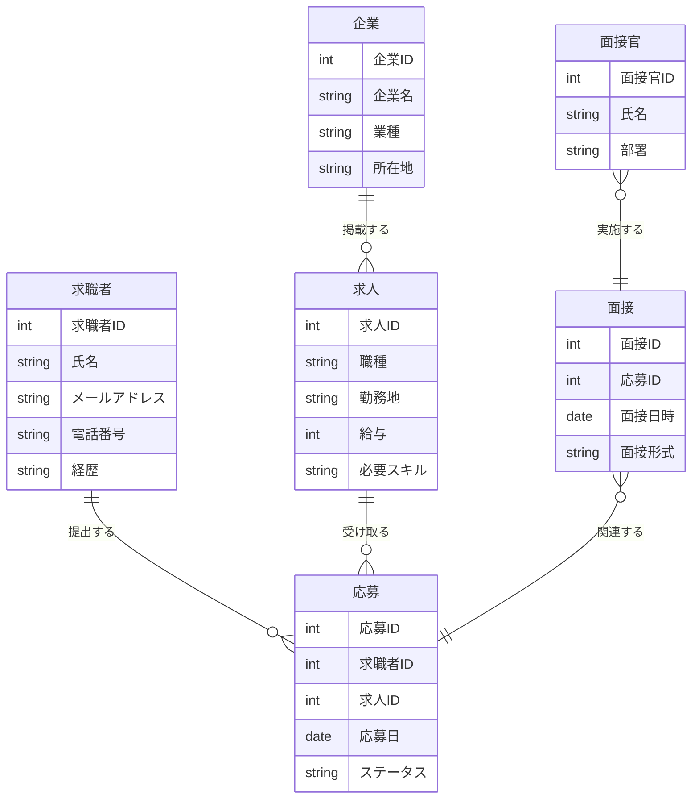

```mermaid

erDiagram
    求職者 ||--o{ 応募 : "提出する"
    求人 ||--o{ 応募 : "受け取る"
    企業 ||--o{ 求人 : "掲載する"
    面接 }o--|| 応募 : "関連する"
    面接官 }o--|| 面接 : "実施する"

    求職者 {
        int 求職者ID
        string 氏名
        string メールアドレス
        string 電話番号
        string 経歴
    }

    求人 {
        int 求人ID
        string 職種
        string 勤務地
        int 給与
        string 必要スキル
    }

    企業 {
        int 企業ID
        string 企業名
        string 業種
        string 所在地
    }

    応募 {
        int 応募ID
        int 求職者ID
        int 求人ID
        date 応募日
        string ステータス
    }

    面接 {
        int 面接ID
        int 応募ID
        date 面接日時
        string 面接形式
    }

    面接官 {
        int 面接官ID
        string 氏名
        string 部署
    }
```
